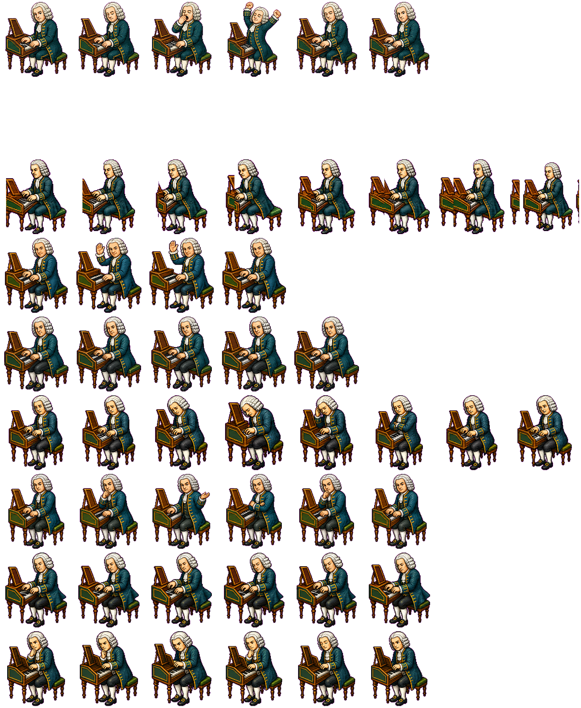

# Bach Typewriter

**Bach Typewriter** is a tiny native macOS companion: a floating animated Bach sits on your desktop and turns typing into a Baroque melody. Every key press advances through a Goldberg-inspired note sequence, so ordinary writing becomes a miniature harpsichord performance.

**Bach Typewriter** 是一个原生 macOS 桌面小伙伴：一只漂浮在桌面上的巴赫会跟着你打字，把每一次按键变成巴洛克旋律。你写字、聊天、敲代码时，它会按顺序播放一段受《哥德堡变奏曲》启发的音符，让键盘变成一台小小羽管键琴。



## Features / 功能

- Floating transparent Bach pet that stays above other windows.
- Animated sprite states for idle, typing, waiting, review, and failure moments.
- Global keyboard listening with local fallback, so notes can play while you type in other apps.
- Sequential melody playback using bundled WAV samples and `AVAudioEngine`.
- Menu bar controls for showing Bach, pausing typing notes, muting sound, playing a test note, and quitting.
- Instrument choices: sampled harpsichord plus macOS General MIDI piano, celesta, harpsichord, and church organ.
- Accessibility and Input Monitoring helpers that open the right macOS settings panel.
- Drag to move Bach; use the small lower-right handle to resize him.

- 透明漂浮的巴赫桌面宠物，会保持在其他窗口之上。
- 多种精灵动画状态：待机、输入、等待授权、试听、异常反馈等。
- 支持全局键盘监听，也有本地监听兜底，因此在其他 App 中打字也能触发音符。
- 使用内置 WAV 采样和 `AVAudioEngine` 顺序播放旋律。
- 菜单栏控制：显示巴赫、暂停打字音符、静音、播放测试音、退出。
- 乐器可选：采样羽管键琴，以及 macOS General MIDI 的钢琴、钢片琴、羽管键琴、教堂管风琴。
- 内置辅助功能和输入监控权限引导，可直接打开对应的 macOS 设置页。
- 可以拖动移动巴赫，也可以拖动右下角的小把手调整大小。

## Current Status / 当前状态

This is a working Swift/AppKit prototype. It runs locally, plays notes, shows the floating pet, and exposes the core menu bar controls. The project is still early: packaging, signing, onboarding polish, and release distribution are not final yet.

这是一个可运行的 Swift/AppKit 原型。它已经能在本地启动、播放音符、显示漂浮宠物，并提供核心菜单栏控制。项目仍处在早期阶段：正式打包、签名、首次引导和发布分发还没有完全定稿。

## Requirements / 环境要求

- macOS 10.15 or newer.
- Swift Package Manager / Xcode toolchain.
- Accessibility and Input Monitoring permissions for global typing notes.

- macOS 10.15 或更新版本。
- Swift Package Manager / Xcode 工具链。
- 如果希望在其他 App 中打字也能触发音符，需要开启辅助功能和输入监控权限。

## Run Locally / 本地运行

```bash
git clone git@github.com:kokafang/bach-typewriter.git
cd bach-typewriter
./scripts/dev-run.sh
```

On first launch, macOS may ask for permissions. If global keyboard listening does not work immediately, open:

```text
System Settings -> Privacy & Security -> Accessibility
System Settings -> Privacy & Security -> Input Monitoring
```

Enable Bach Typewriter, then restart the app.

首次启动时，macOS 可能会请求权限。如果在其他 App 中打字没有触发声音，请打开：

```text
系统设置 -> 隐私与安全性 -> 辅助功能
系统设置 -> 隐私与安全性 -> 输入监控
```

勾选 Bach Typewriter，然后重新启动 App。

## Open in Xcode / 在 Xcode 中打开

This repository is a Swift package, so you can open the package folder directly in Xcode.

这个仓库是一个 Swift Package，因此可以直接用 Xcode 打开项目文件夹。

## How It Works / 工作方式

`KeyboardMonitor` listens for key-down events and sends a simple typing signal to the app. It does not need the typed text itself. `MelodyPlayer` advances through the bundled note sequence, `SoundEngine` routes playback to `BachAudioHelper`, and `PetWindowController` keeps the animated Bach visible above the desktop.

`KeyboardMonitor` 监听按键事件，并把“有人正在打字”的信号传给 App；它不需要读取你输入的具体文字。`MelodyPlayer` 按顺序推进内置旋律，`SoundEngine` 把播放请求交给 `BachAudioHelper`，`PetWindowController` 则负责让动画巴赫漂浮在桌面最前方。

## Project Layout / 项目结构

```text
Sources/bach-typewriter-swift/        Main AppKit app
Sources/BachAudioHelper/              AVAudioEngine helper process
Sources/bach-typewriter-swift/Resources/
  spritesheet.png                     Bach animation atlas
  Sounds/*.wav                        Bundled note samples
scripts/dev-run.sh                    Local development runner
Assets/                               Source visual assets
Preview/                              Local preview app bundle
```

## Privacy / 隐私说明

Bach Typewriter reacts to keyboard events only to trigger musical notes. It does not display, log, upload, or save typed text.

Bach Typewriter 只使用键盘事件来触发音符，不会显示、记录、上传或保存你输入的文字内容。

## Roadmap / 计划

- A signed downloadable macOS build.
- Cleaner first-run permission onboarding.
- More instruments and sound palettes.
- Custom melody modes.
- Position and size persistence.

- 提供已签名、可直接下载的 macOS 版本。
- 优化首次启动的权限引导。
- 增加更多乐器和声音风格。
- 支持自定义旋律模式。
- 记住巴赫的位置和大小。

## License / 许可证

No license has been selected yet.

暂未选择开源许可证。
